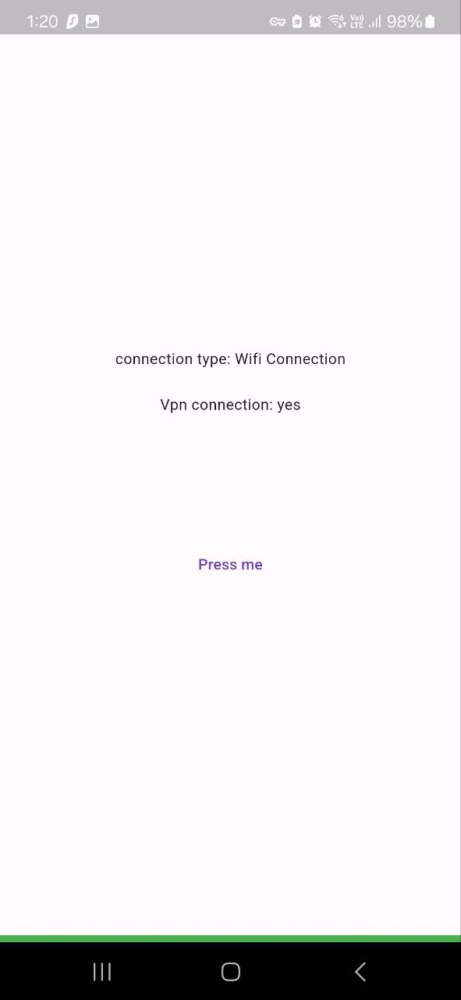
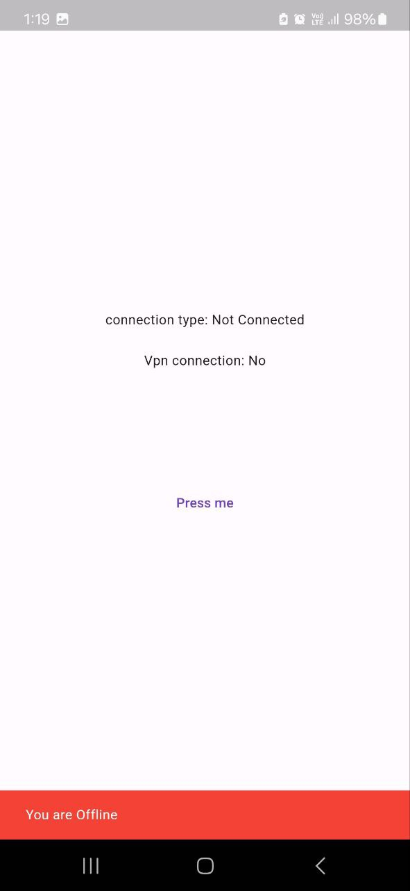
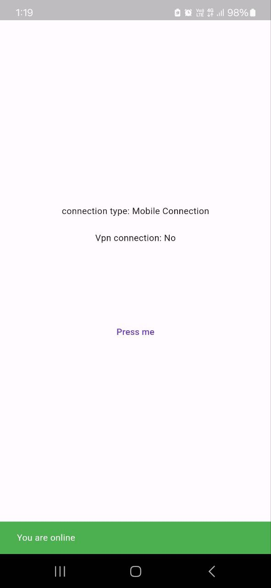

#  ✅ connection_checker

## 📖 About the Project
🚀 A simple Flutter app that checks the device's 🌐 internet connection status, including whether it's ✅ online or ❌ offline, connected via 📶 WiFi or 📱 mobile data, and detects if there is an active 🛡️ VPN connection.

🔧 Built using the connectivity_plus package for reliable 📡 network status monitoring.

---

## 📱 Screenshots

  
  
  

---

## 🛠️ Built With
- [Flutter](https://flutter.dev/) – Cross-platform framework  
- [Dart](https://dart.dev/) – Programming language  

